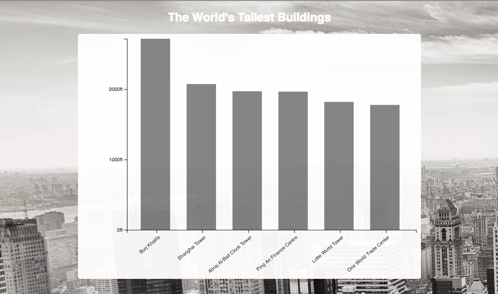

This is a repo for d3 projects.

* Bar-chart pulls in data from a json file and renders the relative height of buildings.

The chart should dynamically adjust if you change the number of buildings in the json file.