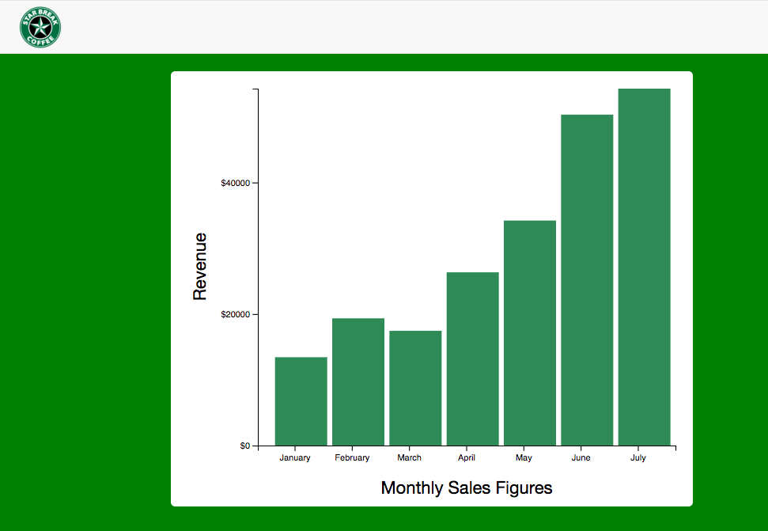

This is a repo for d3 projects.
I am following a tutorial. The master repo is here: https://github.com/adamjanes/udemy-d3

* Bar-chart pulls in data from a json file and renders the relative height of buildings.

Central to understanding how d3 works is the difference between domain and range. Domain is the set of values in your data, whereas range is the context in which the data will be displayed. 


The chart should dynamically adjust if you change the number of buildings in the json file.

* .scaleBand

Bar charts can use a d3.scaleBand() to set the x axis. The .scaleBand method allows you to map each bar onto a datapoint. According to the d3 docs, 'Band scales are typically used for bar charts with an ordinal or categorical dimension.' In the following snippet, I am setting the x-axis to bars, mapping the domain to the name of each building, and then mapping the range to the width of the chart. You can also set padding in the .scaleBand method.

```
const x = d3.scaleBand()
    .domain(data.map(building => building.name))
    .range([0, width])
    .paddingInner(0.3)
    .paddingOuter(0.3)
```

* .scaleOrdinal (Array of strings as one data mapping)

For a heat-map or visualizations in which one of the axes maps onto an array of strings, you might use an ordinal scale. 'Ordinal scales have a discrete domain, such as a set of names or categories.' This scale can be used to associate colors (an array of strings representing colors) with datapoints.

``` 
const nameScale = d3.scaleOrdinal()
    .domain(data)
    .range(["white", "blue", "gray", "black"]);
```

D3 also provides some color scheme arrays that can be used on ordinal scales to map data onto color values. 

``` 
const colors = d3.scaleOrdinal()
    .domain(['January', 'February', 'March', 'April', 'May'])
    .range([d3.schemeCategory10])
```

* Adding labels to axes



Labels are added by applying appending svg text elements and adding css classes to position them properly. The labels can be appened using the group element, conventially called 'g', which applies transformations to a group of css elements.

```
const margin = {top: 20, right: 20, bottom: 70, left: 100}

const g = svg.append('g')
  .attr('transform', `translate(${margin.left},${margin.top})`)

g.append('text')
  .attr('class', 'x axis-label')
  .attr('x', width/2)
  .attr('y', height+55)
  .attr('font-size', '20px')
  .attr('text-anchor', 'middle')
  .text('Monthly Sales Figures')
```

First, the group element is selected by using the css transform property to add margins, which provide the necessary spacing for our labels. The transform:translate(x,y) selector shifts the chart away from the margins. Second, a text svg is appended to the x-label. We are setting css attributes with d3 .attr methods, but the label could also be assigned a class associated with the desired styles.


* Update pattern

The update pattern can be used to make a visualization more dynamic by cycling data in and out of the visualization over time. There are three stages of the update pattern.
* EXIT has access to elements on the page but not in data
Exit is usually used to clear visualizations from the screen.
* UPDATE: for each datapoint, create or update an element
* ENTER : has access to elements that are in data array but not on page

Here, the update pattern is used to change the area of each datapoint on the scatterplot.


[](https://youtu.be/umCaRHEGyro)

